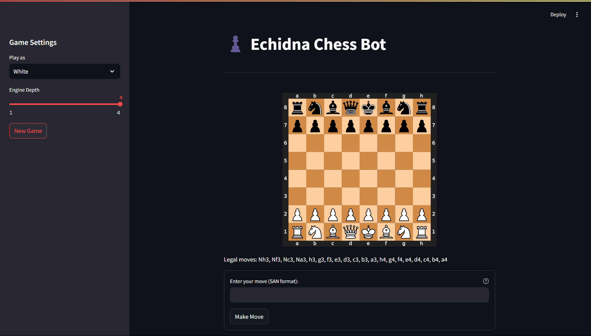

# Echidna Chess Bot


This is a simple chess bot implemented using Python and the `python-chess` library. It uses a minimax algorithm with alpha-beta pruning to play against a human player.

## ♟️ Features
- Chess game simulation using `python-chess`
- Minimax algorithm with alpha-beta pruning
- Basic evaluation function to assess board states
- Supports moves for both human and AI

## ♘ Screenshot



## ♕ Prerequisites
Ensure you have the following installed:
- Python 3.x
- `python-chess` library

Install the library using:
```bash
pip install chess
```

## ♖ Project Structure
- `main.py` - Handles game logic and interaction
- `chess_engine.py` - Implements the chess engine using minimax algorithm
- `README.md` - Project documentation

## ♗ How to Run
1. Clone the repository:
    ```bash
    git clone <git clone https://github.com/HilalAhmad01/Echidna_Chess_Bot.git>
    cd Chess-Bot
    ```
2. Run the game:
    ```bash
    python main.py
    ```

## ♜ How It Works
- The game starts with an empty board and a new game initialized.
- The AI uses the minimax algorithm to analyze possible moves and make the best one based on its evaluation.
- The evaluation function considers material balance, piece positioning, and winning opportunities.

## ♝ Troubleshooting
- **Invalid moves:** Ensure legal moves are made. If no moves are available, the game may end in checkmate or stalemate.
- **AI not responding:** Adjust the `maxDepth` parameter in `main.py` to ensure the AI responds efficiently.
- **Python-chess missing:** Reinstall using `pip install chess`.

## ♔ Contributions
Feel free to contribute! Submit a pull request or open an issue for bug reports and feature requests.

## ♙ License
This project is licensed under the MIT License.

